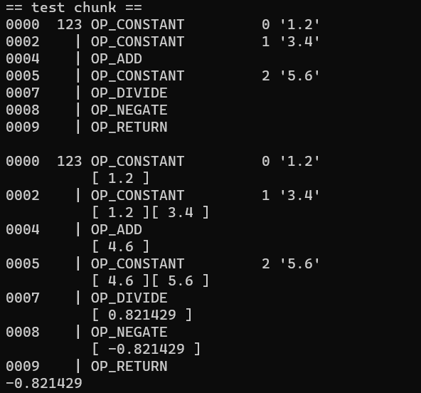

# Clox Compiler

The Clox Compiler is a lightweight and extensible programming language implementation, designed for simplicity and ease of use. This repository contains the source code and related files for the Clox compiler (Chapters 14 & 15).

## Overview

Clox is a dynamically-typed scripting language inspired by various programming languages, with a focus on providing a flexible and efficient execution environment. The compiler translates Clox source code into bytecode, which is then executed by the Clox Virtual Machine.

## Features

- **Dynamic Typing**: Clox supports dynamic typing, providing flexibility in variable declarations and usage.
- **Garbage Collection**: The compiler incorporates a garbage collector for automatic memory management.
- **Extensibility**: Designed with extensibility in mind, allowing for easy addition of new features and optimizations.

## Getting Started

To compile and run Clox programs, follow these steps:

1. **Clone the Repository:**
   ```bash
   git clone https://github.com/Islam-hady9/clox.git
   cd clox
   ```
   
2. Navigate to the `clox` directory:
   ```bash
   cd clox
   ```
   
3. Build the Clox interpreter:
   ```bash
   gcc main.c memory.c chunk.c debug.c value.c vm.c -o main
   ```
   
4. Run the Clox interpreter with a script:
   ```bash
   ./main
   ```
   
- The Outputs:
  
  
  
## Additional Resources

- [Crafting Interpreters Book](https://craftinginterpreters.com/): The official website for the book with free online access.

- [Clox Repository](https://github.com/munificent/craftinginterpreters): The original repository for the Clox code.
  
## Acknowledgments

Special thanks to the authors of the "Crafting Interpreters" book, which served as a valuable resource in the development of Clox.
